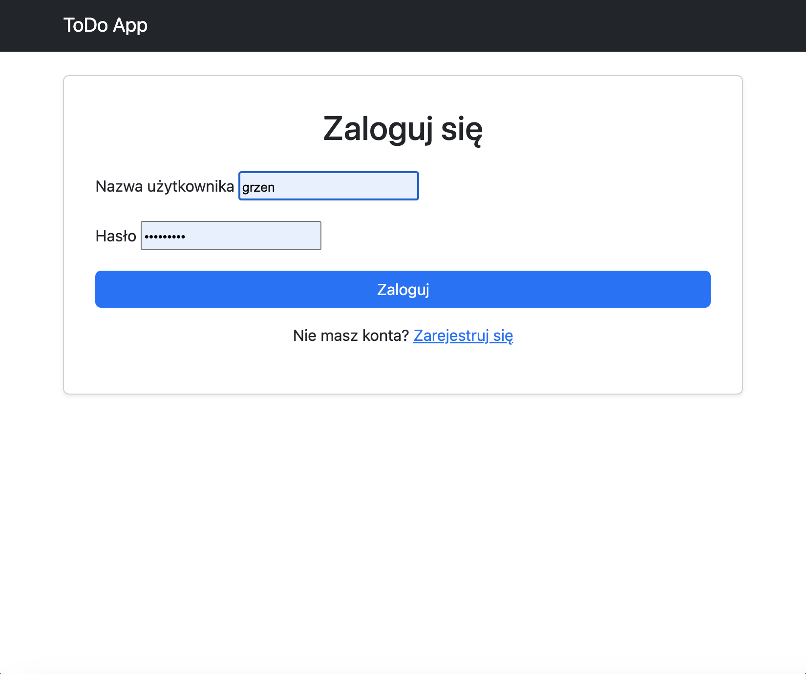
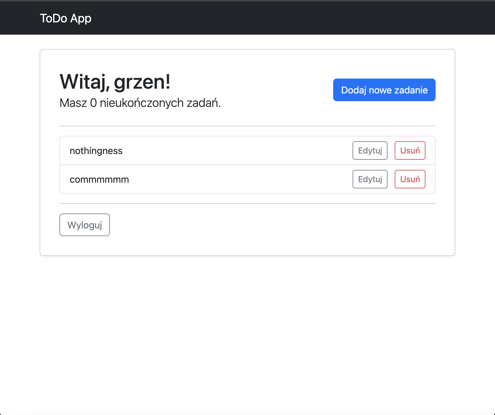
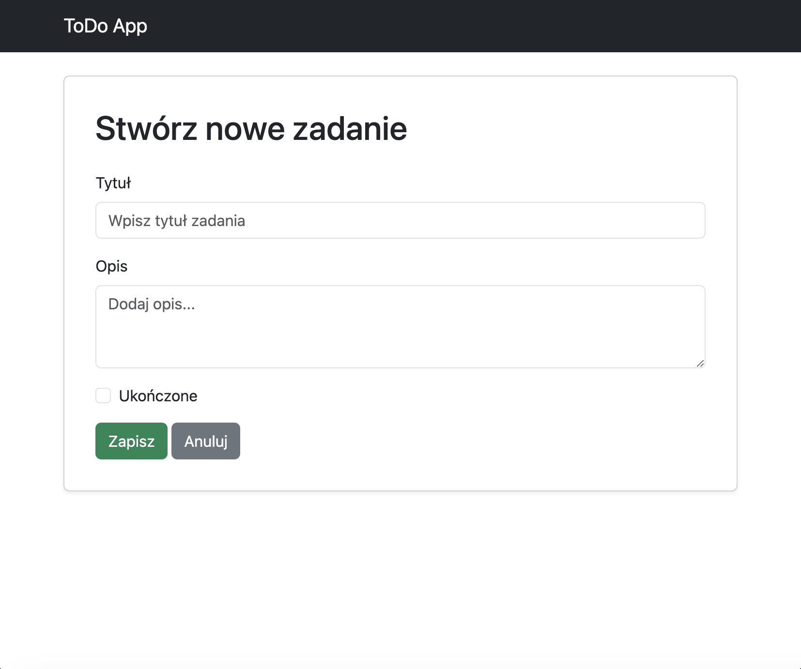

# Django ToDo App

[](https://github.com/Garseniuk/todo-project/actions/workflows/django-ci.yml)

A simple yet full-featured ToDo list web application built with Python and Django. This project demonstrates a complete software development lifecycle, including user authentication, CRUD operations, automated testing, containerization with Docker, and a CI/CD pipeline with GitHub Actions.

## Screenshots

| Login Page | Task List | Edit Form |
| :---: | :---: | :---: |
|  |  |  |

## Key Features

*   **User Authentication:** Full user registration, login, and logout system.
*   **Private Task Lists:** Each user can only view and manage their own tasks.
*   **CRUD Operations:** Full support for Creating, Reading, Updating, and Deleting tasks.
*   **Automated Testing:** Core functionalities are covered by unit tests to ensure code quality.
*   **Containerization:** The application is fully containerized using Docker and Docker Compose for portability and easy setup.
*   **CI/CD Pipeline:** An automated GitHub Actions workflow runs all tests on every push to the `main` branch.
*   **Responsive Design:** The user interface is built with Bootstrap and adapts to different screen sizes.

## Technologies Used

*   **Backend:** Python, Django
*   **Frontend:** HTML, CSS, Bootstrap 5
*   **Database:** SQLite (for development)
*   **Testing:** `unittest` (built-in Django module)
*   **DevOps:** Docker, Docker Compose, Git, GitHub Actions (CI/CD)

## How to Run

### Option 1: Run with Docker (Recommended)

1.  **Prerequisites:** Ensure you have **Docker Desktop** installed and running.
2.  **Clone the repository:**
    ```bash
    git clone https://github.com/Garseniuk/todo-project.git
    cd todo-project
    ```
3.  **Build and run the containers:**
    ```bash
    docker compose up --build
    ```
The application will be available in your browser at `http://127.0.0.1:8000/`.

### Option 2: Run Locally with Python

1.  **Clone the repository and navigate to the project folder.**
2.  **Create and activate a virtual environment.**
3.  **Install dependencies (`pip install -r requirements.txt`).**
4.  **Run database migrations (`python manage.py migrate`).**
5.  **Start the development server (`python manage.py runserver`).**